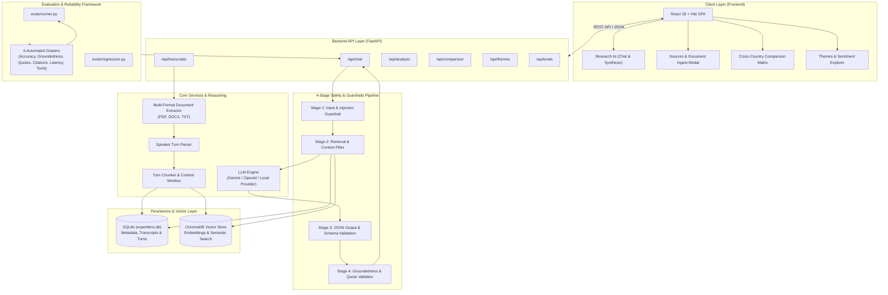
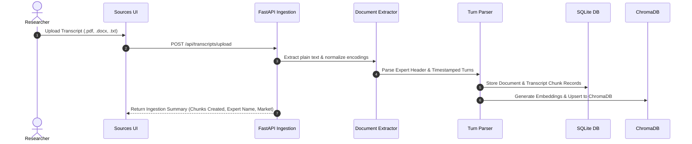
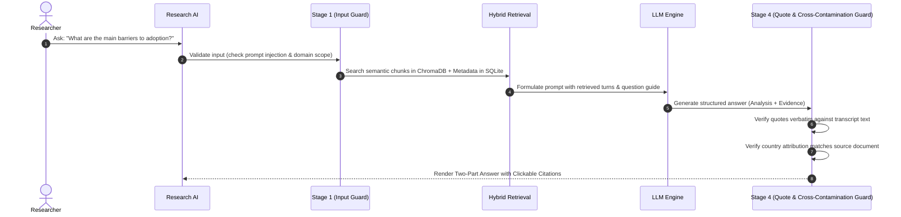

# 🔬 ExpertLens AI

 
> Built with FastAPI, React, ChromaDB, SQLite, and strict 4-Stage Safety Guardrails.

[](https://python.org)
[](https://fastapi.tiangolo.com)
[](https://react.dev)
[](https://www.trychroma.com/)
[]()
[]()

---

## 📖 Table of Contents
- [Executive Overview](#-executive-overview)
- [System Architecture](#-system-architecture)
- [End-to-End Data Flow](#-end-to-end-data-flow)
- [Core Capabilities](#-core-capabilities)
- [4-Stage Guardrails Pipeline](#-4-stage-guardrails-pipeline)
- [Evaluation & Reliability Suite](#-evaluation--reliability-suite)
- [Project Directory Structure](#-project-directory-structure)
- [Getting Started](#-getting-started)
  - [Prerequisites](#prerequisites)
  - [Backend Setup](#1-backend-setup)
  - [Frontend Setup](#2-frontend-setup)
  - [Environment Configuration](#3-environment-configuration)
- [API Reference](#-api-reference)
- [Testing & Quality Assurance](#-testing--quality-assurance)

---

## 🌟 Executive Overview

In strategic consulting and market research, qualitative expert interview transcripts are high-value sources of intelligence. However, manual synthesis across multiple regions is time-intensive and vulnerable to confirmation bias and cross-country factual contamination.

**ExpertLens AI** solves this with an auditable research engine that:
1. Ingests transcripts in **PDF, Word (.docx, .doc), and Plain Text** formats with second-level timestamp accuracy.
2. Employs a **hybrid vector and relational retrieval architecture** (ChromaDB + SQLite).
3. Produces **two-part verified answers**: a structured cross-market synthesis followed by exact timestamped verbatim evidence.
4. Enforces a **4-stage safety guardrail pipeline** to block prompt injections, prevent hallucinations, and guarantee zero cross-country factual contamination.

---

## 🏛️ System Architecture



---

## 🔄 End-to-End Data Flow

### 1. Ingestion Pipeline


### 2. Query & Verifiable Synthesis Pipeline


---

## ⚡ Core Capabilities

| Feature | Description | Key Component |
|---|---|---|
| **Multi-Format Ingestion** | Upload `.pdf`, `.docx`, `.doc`, `.txt` or paste raw text. Automatically extracts expert name, country, role, and timestamped turns. | [`document_extractor.py`](backend/app/services/document_extractor.py), [`parser.py`](backend/app/services/parser.py) |
| **Research AI** | Ask complex cross-market qualitative questions with multi-turn conversation and context management. | [`chat.py`](backend/app/api/chat.py), [`retrieval.py`](backend/app/services/retrieval.py) |
| **Two-Part Verifiable Answers** | Outputs a comprehensive **Synthesized Analysis** grouped by country followed by **Verbatim Transcript Evidence** with exact timestamps. | [`local_provider.py`](backend/app/llm/local_provider.py) |
| **Quote Validator** | Fuzzy + exact string matching ensuring every cited quote exists in the source transcript. | [`quote_validator.py`](backend/app/services/quote_validator.py) |
| **Cross-Country Matrix** | Tabular side-by-side comparison across key dimensions (Adoption, Economics, Training, Outlook). | [`comparison.py`](backend/app/services/comparison.py) |
| **Theme & Trend Discovery** | Automated clustering of market drivers, common themes, and unique country-level dynamics. | [`themes.py`](backend/app/services/themes.py) |

---

## 🛡️ 4-Stage Guardrails Pipeline

```text
[User Prompt]
      │
      ▼
┌─────────────────────────────────────────────────────────────┐
│ Stage 1: Input Validation                                   │
│ • Detects prompt injections (system prompts, jailbreaks)    │
│ • Validates domain entities & query relevance               │
└─────────────────────────────┬───────────────────────────────┘
                              ▼
┌─────────────────────────────────────────────────────────────┐
│ Stage 2: Retrieval & Context Guardrail                      │
│ • Aligns query with market/country and expert filters       │
│ • Enforces minimum context relevance thresholds             │
└─────────────────────────────┬───────────────────────────────┘
                              ▼
┌─────────────────────────────────────────────────────────────┐
│ Stage 3: Structured Output Guardrail                        │
│ • Validates strict JSON / markdown output structure         │
│ • Ensures required sections (Analysis + Evidence) are present│
└─────────────────────────────┬───────────────────────────────┘
                              ▼
┌─────────────────────────────────────────────────────────────┐
│ Stage 4: Groundedness & Anti-Contamination Guardrail        │
│ • Verifies cited quotes against source turns (exact/fuzzy)  │
│ • Prevents cross-country fact contamination                 │
│ • Executes safe abstention when evidence is insufficient    │
└─────────────────────────────┬───────────────────────────────┘
                              │
                              ▼
                       [Safe Output]
```

---

## 📊 Evaluation & Reliability Suite

The evaluation suite is built as a core system component in `backend/evals/` to benchmark performance and prevent regressions.

- **Benchmark Dataset**: Real transcript evaluation cases (`data/evals/benchmark_dataset.json`).
- **6 Automated Graders**:
  1. `AccuracyGrader`: Measures factual alignment and completeness.
  2. `GroundednessGrader`: Flags hallucinations and ungrounded statements.
  3. `QuoteGrader`: Checks verbatim quote existence and timestamp precision.
  4. `CitationGrader`: Validates correct speaker and market attribution.
  5. `LatencyGrader`: Enforces response latency SLAs (< 2.5s).
  6. `ToolExecutionGrader`: Traces tool usage and parameter precision.
- **Inter-Annotator Review**: `evals/human_review/agreement.py` calculating Cohen's Kappa & Pearson correlation.
- **CI/CD Regression Check**: `evals/regression.py` preventing metric drops.

```bash
# Run the evaluation benchmark suite
python -m evals.runner

# Run the regression gate
python -m evals.regression
```

---

## 📂 Project Directory Structure

```text
Hasamex_Project/
├── backend/
│   ├── app/
│   │   ├── api/                 # FastAPI Route Handlers (chat, transcripts, etc.)
│   │   ├── guardrails/          # 4-Stage Safety Guardrails Pipeline
│   │   ├── llm/                 # LLM Adapters (Local, Gemini, OpenAI)
│   │   ├── models/              # SQLAlchemy Database Models
│   │   ├── schemas/             # Pydantic Schemas
│   │   ├── services/            # Core Services (Ingestion, Parser, Retrieval, Quotes)
│   │   ├── tools/               # Retrieval & Filter Tools
│   │   ├── vectorstore/         # ChromaDB Client & Indexer
│   │   ├── config.py            # Environment Configuration
│   │   ├── database.py          # Async Database Session
│   │   └── main.py              # FastAPI Application Entrypoint
│   ├── evals/                   # Evaluation & Reliability Framework
│   │   ├── ab_testing/          # A/B Testing Evaluation Harness
│   │   ├── datasets/            # Benchmark Dataset Loaders
│   │   ├── graders/             # 6 Automated Grader Modules
│   │   ├── human_review/        # Inter-Annotator Agreement Engine
│   │   ├── runner.py            # Benchmark Execution Runner
│   │   └── regression.py        # Regression Testing Gate
│   ├── tests/                   # 35 Pytest Unit & Integration Tests
│   └── requirements.txt         # Python Dependencies
├── frontend/
│   ├── src/
│   │   ├── components/          # Reusable UI Components (Sidebar, EvidenceCard, Drawer)
│   │   ├── pages/               # Views (Research, Sources, Analysis, Comparison, Themes)
│   │   ├── services/            # Axios API Client
│   │   ├── types/               # TypeScript Interfaces
│   │   ├── App.tsx              # Root Routing & Shell
│   │   └── index.css            # Styles & Tokens
│   ├── package.json             # Frontend Dependencies
│   └── vite.config.ts           # Vite Bundler Config
├── data/
│   ├── transcripts/             # Benchmark Transcripts (France, Germany, UK)
│   └── evals/                   # Ground Truth Benchmark Cases
├── .env.example                 # Sample Environment Configuration
├── .gitignore                   # Git Ignore Configuration
└── README.md                    # Project Documentation
```

---

## 🚀 Getting Started

### Prerequisites
- **Python**: `3.11+`
- **Node.js**: `v18+` and `npm`
- **Git**

---

### 1. Backend Setup

```bash
# Navigate to backend directory
cd backend

# Create and activate a Python virtual environment
python -m venv .venv

# On Windows:
.venv\Scripts\activate
# On macOS / Linux:
source .venv/bin/activate

# Install dependencies
pip install -r requirements.txt

# Start the FastAPI backend server
uvicorn app.main:app --reload --host 127.0.0.1 --port 8000
```

The backend server will run on `http://127.0.0.1:8000` (API Docs available at `http://127.0.0.1:8000/docs`).

---

### 2. Frontend Setup

```bash
# Open a new terminal and navigate to frontend directory
cd frontend

# Install dependencies
npm install

# Start the Vite development server
npm run dev
```

The frontend will be available at `http://localhost:5173`.

---

### 3. Environment Configuration

Copy `.env.example` to `.env` in the root or backend directory:

```bash
cp .env.example .env
```

| Variable | Description | Default |
|---|---|---|
| `APP_ENV` | Environment (`development` / `production`) | `development` |
| `LLM_PROVIDER` | Active LLM (`local`, `gemini`, `openai`) | `local` |
| `GEMINI_API_KEY` | Google Gemini API Key (if using Gemini) | `""` |
| `OPENAI_API_KEY` | OpenAI API Key (if using OpenAI) | `""` |
| `DATABASE_URL` | SQLite database URI | `sqlite+aiosqlite:///./expertlens.db` |
| `CHROMA_PERSIST_DIR` | Local ChromaDB vector database directory | `./data/chroma` |
| `GUARDRAILS_ENABLED`| Enable 4-stage guardrail enforcement | `true` |

---

## 🔌 API Reference

### Transcripts
- `GET /api/transcripts`: List all ingested transcripts.
- `GET /api/transcripts/{document_id}`: Retrieve full transcript detail with chunked turns.
- `POST /api/transcripts/upload`: Upload `.pdf`, `.docx`, `.doc`, or `.txt` file.
- `POST /api/transcripts/create`: Ingest transcript from structured JSON text.
- `POST /api/transcripts/seed`: Seed database with baseline European robotic surgery transcripts.

### Research & Analysis
- `POST /api/chat`: Send query to the research AI assistant.
- `GET /api/analysis`: Retrieve question-by-question cross-country breakdown.
- `GET /api/comparison`: Retrieve country comparison matrix.
- `GET /api/themes`: Retrieve extracted thematic clusters and sentiment signals.

---

## 🧪 Testing & Quality Assurance

Run the comprehensive test suite (35 passing tests covering parser, chunking, classification, document extractor, guardrails, quote validation, and evaluation framework):

```bash
# Run unit & integration tests
pytest backend/tests -v
```

---

## 📄 License
This project is licensed under the MIT License — see the [LICENSE](LICENSE) file for details.
